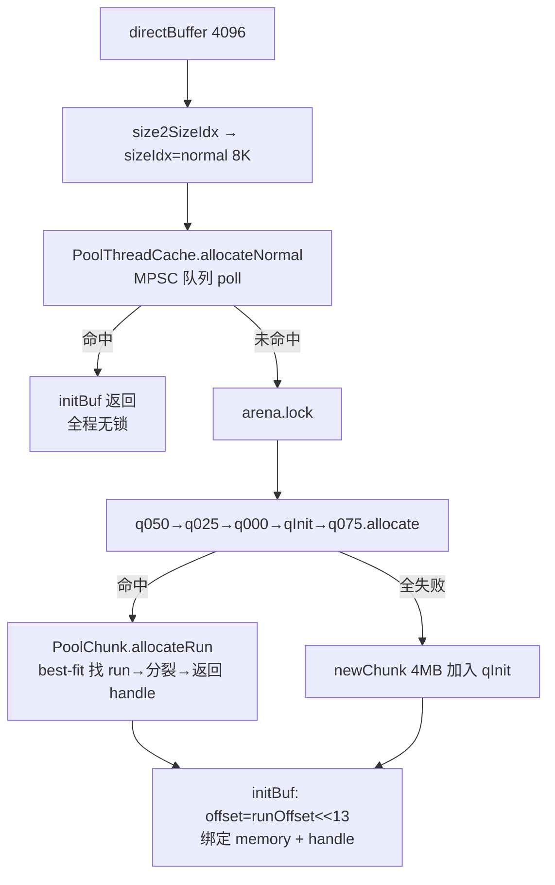
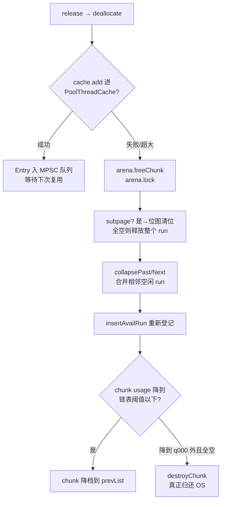

# Netty 内存池源码深度解析

> 基于源码版本：`d:\yanyun\netty`（Netty 4.x，含 4.2 的 AdaptivePoolingAllocator）
> 核心模块：`buffer/src/main/java/io/netty/buffer/`

---

## 一、为什么需要内存池？

网络应用中 ByteBuf 的分配/释放极其频繁。直接依赖 JVM（堆内 `byte[]` 的 GC、堆外 `ByteBuffer.allocateDirect` 的系统调用）会带来：

- GC 压力（堆内）与分配停顿
- 堆外内存分配/释放是重量级系统调用（`malloc`/`free` 或 `mmap`/`munmap`）
- 内存碎片、多线程锁竞争

Netty 的方案是借鉴 **jemalloc** 的思想：**Arena（竞技场）+ Chunk（块）+ Page（页）+ Subpage（子页）+ ThreadCache（线程缓存）** 的多级结构。

```
PooledByteBufAllocator (buffer/.../PooledByteBufAllocator.java)
        │
        ├── PoolThreadCache (线程本地缓存，无锁分配)
        │
        └── PoolArena[] (heap / direct 两组，默认 2*CPU 个)
                │
                ├── smallSubpagePools[] (Small 级别的 subpage 链表)
                │        └── PoolSubpage (位图 bitmap 管理)
                │
                └── PoolChunkList 链: qInit → q000 → q025 → q050 → q075 → q100
                         │
                         └── PoolChunk (默认 4MB，Runs 分割/合并算法)
                                  └── Page (默认 8KB)
```

---

## 二、入口：`PooledByteBufAllocator`

文件：`buffer/src/main/java/io/netty/buffer/PooledByteBufAllocator.java`

### 2.1 关键默认参数（静态块中初始化）

```java
int defaultPageSize = SystemPropertyUtil.getInt("io.netty.allocator.pageSize", 8192);
int defaultMaxOrder = SystemPropertyUtil.getInt("io.netty.allocator.maxOrder", 9);
// chunkSize = pageSize << maxOrder = 8192 << 9 = 4MB
```

| 参数 | 默认值 | 含义 |
|---|---|---|
| `pageSize` | 8192 | 页大小 8KB |
| `maxOrder` | 9 | chunk = 4MB |
| `numDirectArena` | `min(2*CPU, maxDirectMemory/chunkSize/2/3)` | arena 数量 |
| `smallCacheSize` | 256 | 线程缓存中 small 队列长度 |
| `normalCacheSize` | 64 | 线程缓存中 normal 队列长度 |
| `maxCachedBufferCapacity` | 32KB | 线程缓存最大可缓存容量 |

**arena 数量为什么是 `2 × CPU`？** 源码注释写得很清楚：因为 NIO/EPOLL 的 EventLoop 默认也是 `2 × CPU` 个，让每个 EventLoop 线程尽量独占一个 arena，减少对 `PoolArena` 同步锁的竞争（见 issue #3888）。

### 2.2 线程与 arena 的绑定

```java
private final class PoolThreadLocalCache extends FastThreadLocal<PoolThreadCache> {
    @Override
    protected synchronized PoolThreadCache initialValue() {
        final PoolArena<byte[]> heapArena = leastUsedArena(heapArenas);
        final PoolArena<ByteBuffer> directArena = leastUsedArena(directArenas);
        ...
        // 只有 FastThreadLocalThread（即 EventLoop 线程）或
        // useCacheForAllThreads=true 时才启用缓存
        if (useCacheForAllThreads || current instanceof FastThreadLocalThread || executor != null) {
            return new PoolThreadCache(heapArena, directArena, smallCacheSize, ...);
        }
        // 普通线程不缓存，避免内存滞留
        return new PoolThreadCache(heapArena, directArena, 0, 0, 0, 0, false);
    }
}
```

要点：

- 通过 `FastThreadLocal`（Netty 自己实现的、基于数组下标而非哈希的 ThreadLocal）为每个线程缓存一个 `PoolThreadCache`；
- 绑定 arena 时用 `leastUsedArena()` 选择**绑定线程数最少的 arena**，实现负载均衡；
- **非 EventLoop 的普通线程默认不启用线程缓存**，防止普通业务线程频繁创建销毁导致池外内存堆积。

---

## 三、`SizeClasses`：大小规格化

文件：`buffer/src/main/java/io/netty/buffer/SizeClasses.java`

所有分配请求先被**规格化（normalize）**到离散的 size class 上，这是池化的基础。生成规则：

- 最小量子 `LOG2_QUANTUM = 4`（16 字节起）；
- 每组 4 个规格（`LOG2_SIZE_CLASS_GROUP = 2`），每个 size 按 $(1 << log2Group) + nDelta \times (1 << log2Delta)$ 计算，例如：16、32、48、64、80、96、112、128、160、192 …
- **Small**：`size < pageSize`（用 subpage 切分）
- **Normal**：`pageSize ≤ size < chunkSize`（按整页 run 分配）
- **Huge**：`size ≥ chunkSize`（不池化，直接 `allocateHuge` 走 unpooled chunk）

同时预生成三张查找表：`sizeIdx2sizeTab`、`pageIdx2sizeTab`、`size2idxTab`（≤4KB 直接查表），把 O(log n) 的换算变成 O(1) 数组访问。

---

## 四、`PoolChunk`：核心的 Runs 分配算法

文件：`buffer/src/main/java/io/netty/buffer/PoolChunk.java`（文件头部有完整的算法注释）

一个 chunk 默认 4MB = 512 页。它不是经典的完全二叉树 buddy，而是 **Runs（连续页段）+ 优先队列 + 哈希表** 的实现：

### 4.1 handle：64 位编码的内存地址

```
oooooooo oooooos ssssssss ssssssue bbbbbbbb bbbbbbbb bbbbbbbb bbbbbbbb
├─ runOffset 15bit  ├── size(页数) 15bit |u|e|── bitmapIdx 32bit──────┘

o: run 在 chunk 内的页偏移
s: run 占多少页
u: isUsed（是否已使用）
e: isSubpage（是否被切分为 subpage）
b: subpage 位图索引（非 subpage 时为 0）
```

一个 `long` 就完整描述了一段内存的位置、大小、类型——后续 ByteBuf 的释放只凭这个 handle 即可完成，无需额外元数据对象。

### 4.2 两个核心数据结构

```java
// 每个 runsAvail[i] 是一个按 runOffset 排序的优先队列，管理"恰好 i 档页数"的空闲 run
private final IntPriorityQueue[] runsAvail;

// runOffset -> handle，同时登记每个 run 的首页和尾页，用于 O(1) 找相邻 run 做合并
private final LongLongHashMap runsAvailMap;
```

### 4.3 分配 run（`allocateRun`）

```java
private long allocateRun(int runSize) {
    int pages = runSize >> pageShifts;
    runsAvailLock.lock();
    try {
        // 1. 从最小能容纳 pages 的桶开始找第一个非空队列（best-fit）
        int queueIdx = runFirstBestFit(pageIdx);
        // 2. 取该队列中 offset 最小的 run（低地址优先，减少碎片）
        long handle = queue.poll();
        removeAvailRun0(handle);
        // 3. 若 run 比请求大，把剩余部分切割出来重新登记（splitLargeRun）
        handle = splitLargeRun(handle, pages);
        freeBytes -= pinnedSize;
        return handle;
    } finally { ... }
}
```

`splitLargeRun` 中剩余尾段通过 `insertAvailRun` 重新放回 `runsAvail`/`runsAvailMap`——这就是"伙伴算法的分裂"。

### 4.4 释放与合并（`free` + `collapseRuns`）

```java
void free(long handle, int normCapacity, ByteBuffer nioBuffer) {
    if (isSubpage(handle)) {
        // 1. 先归还给 subpage 位图；只有 subpage 整体空闲且链表里不止它一个时才继续释放 run
        if (subpage.free(head, bitmapIdx(handle))) { return; }
    }
    runsAvailLock.lock();
    try {
        // 2. 向前、向后合并相邻空闲 run（利用 runsAvailMap 的首尾页索引）
        long finalRun = collapseRuns(handle);
        // 3. 清掉 isUsed/isSubpage 位，重新登记
        insertAvailRun(runOffset(finalRun), runPages(finalRun), finalRun);
    } finally { ... }
}
```

`collapsePast` 通过 `runsAvailMap.get(runOffset - 1)` 找前一个 run 的尾页，`collapseNext` 通过 `runsAvailMap.get(runOffset + runPages)` 找后一个 run 的首页，连续就合并——这就是"伙伴算法的合并"。**碎片治理的保证：空闲内存永远尽量聚合回大块。**

### 4.5 细节亮点：`cachedNioBuffers`

```java
private final Deque<ByteBuffer> cachedNioBuffers;
```

`nioBuffer()` 调用频繁，直接 `memory.duplicate()` 会产生 GC 压力，所以每个 chunk 缓存复用 ByteBuffer"壳"（最多 `maxCachedByteBuffersPerChunk=1023` 个）。

---

## 五、`PoolSubpage`：小内存的位图管理

文件：`buffer/src/main/java/io/netty/buffer/PoolSubpage.java`

Small 级别（<8KB）的分配不会独占整页，而是把一个 run 按 `elemSize` 等分，用位图管理：

```java
maxNumElems = numAvail = runSize / elemSize;   // 例如 8KB/128B = 64 个槽位
bitmap = new long[(maxNumElems + 63) >>> 6];   // 每个 long 管 64 个槽
```

**分配**（`allocate()`）：

```java
final int bitmapIdx = getNextAvail();
int q = bitmapIdx >>> 6;          // 定位 long
int r = bitmapIdx & 63;           // 定位 bit
bitmap[q] |= 1L << r;             // 置 1 占用
if (--numAvail == 0) {
    removeFromPool();             // 满了，从 arena 的 subpage 链表摘除
}
```

**释放**（`free()`）的三种情况：

1. `numAvail++ == 0`：从全满恢复 → `addToPool` 重新挂回链表；
2. 部分占用 → 返回 `true`，run 继续保留；
3. `numAvail == maxNumElems`（全空）且链表中还有同类 subpage → `doNotDestroy = false`、摘除链表，返回 `false`，让上层把整个 run 归还给 chunk（避免一个 16B 的小分配锁死一整页内存）。

### Subpage run 的大小：`calculateRunSize`

分配 subpage 时，run 大小取 **pageSize 与 elemSize 的最小公倍数**，同时限制元素数不超过 `1 << (pageShifts - LOG2_QUANTUM)` = 512（保证 bitmap 不至于太大）。这样不同 elemSize 的 run 都能整页对齐，释放时可无缝并回。

---

## 六、`PoolArena` 与 `PoolChunkList`：chunk 的生命周期

文件：`buffer/src/main/java/io/netty/buffer/PoolArena.java`、`PoolChunkList.java`

### 6.1 六个 chunk 链表按使用率分级

```
q100 (100%) ← q075 (75~100%) ← q050 (50~100%) ← q025 (25~75%) ← q000 (1~50%) ← qInit (<25%)
```

- **分配顺序**：`q050 → q025 → q000 → qInit → q075`，都失败才 `newChunk` 并加入 `qInit`。
- 为什么先从 q050 开始？**优先使用"半满"的 chunk**：太空的 chunk 留着它有可能被完全释放归还系统（q000 的 chunk 释放到 usage=0 时 `move0` 返回 false → `destroyChunk` 真正释放内存），太满的 chunk（q075/q100）分配失败率高。这是内存占用与分配成功率的折中。
- chunk 在链表间**自动迁移**：`PoolChunkList.allocate` 成功后若 `freeBytes <= freeMinThreshold` 就移入 nextList（升档）；`PoolChunkList.free` 释放后若 `freeBytes > freeMaxThreshold` 就移入 prevList（降档），降到 q000 之外且完全空闲 → 销毁 chunk 归还操作系统。

### 6.2 arena 级别的分配入口

```java
private void allocate(PoolThreadCache cache, PooledByteBuf<T> buf, final int reqCapacity) {
    final int sizeIdx = sizeClass.size2SizeIdx(reqCapacity);
    if (sizeIdx <= sizeClass.smallMaxSizeIdx) {
        tcacheAllocateSmall(...);   // Small
    } else if (sizeIdx < sizeClass.nSizes) {
        tcacheAllocateNormal(...);  // Normal
    } else {
        allocateHuge(buf, ...);     // Huge：unpooled，直接分配
    }
}
```

`tcacheAllocateSmall` 的顺序：**线程缓存 → arena 的 subpage 链表（`smallSubpagePools[sizeIdx]`，锁粒度是链表头）→ allocateNormal（arena 全局锁）**。锁粒度层层放大，竞争逐步升级。

---

## 七、`PoolThreadCache`：无锁的第一级缓存

文件：`buffer/src/main/java/io/netty/buffer/PoolThreadCache.java`

这是 jemalloc tcache 的翻版，注释里直接引用了 jemalloc 论文。结构：

```java
MemoryRegionCache<T>[] smallSubPageDirectCaches; // 每个 small sizeIdx 一个，容量 256
MemoryRegionCache<T>[] normalDirectCaches;       // 8KB~32KB 每个规格一个，容量 64
```

每个 `MemoryRegionCache` 内部是一个 **MPSC 队列**，元素是复用的 `Entry{chunk, nioBuffer, handle, normCapacity}`：

```java
// 分配：poll 出 Entry，直接 initBuf —— 完全无锁！
public final boolean allocate(PooledByteBuf<T> buf, ...) {
    Entry<T> entry = queue.poll();
    if (entry == null) return false;
    initBuf(entry.chunk, entry.nioBuffer, entry.handle, buf, reqCapacity, threadCache);
    ...
}

// 释放：offer 进队列，内存不真正归还 arena
public final boolean add(PoolChunk<T> chunk, ByteBuffer nioBuffer, long handle, int normCapacity) { ... }
```

### 防止内存滞留的三个机制

1. **trim**：`allocate` 中每累计 `freeSweepAllocationThreshold`（默认 8192）次分配触发一次 `trim()`，把"分配次数少于容量空闲数"的冷队列清掉归还 arena；
2. **FreeOnFinalize**：线程退出（FastThreadLocal `onRemoval` 或 finalizer）时 `free()`，把缓存里的所有 entry 真正归还 arena——防止线程池场景下线程销毁导致内存"永久丢失"；
3. **maxCachedBufferCapacity = 32KB**：大 buffer 不进线程缓存，立即归还，避免单线程缓存占用过多。

### ByteBuf 对象本身的复用

`PooledByteBuf` 通过 `Recycler`（`recyclerHandle.unguardedRecycle(this)`，见 `PooledByteBuf.deallocate()`）回收对象壳，配合引用计数 `ReferenceCountUpdater`——**内存复用 + 对象复用**双管齐下，GC 压力趋近于零。

---

## 八、完整分配/释放链路

**分配 `alloc.directBuffer(4096)`：**



**释放 `buf.release()`（引用计数归零）：**



---

## 九、新一代：`AdaptivePoolingAllocator`

这是 Netty 4.2 引入的**自适应分配器**（`AdaptiveByteBufAllocator` 的底层），采用了与上面完全不同的设计——**反世代假设（anti-generational hypothesis）**：

- **Magazine（弹匣）代替 Arena**：每个线程按 thread id 哈希到一个 magazine，从 magazine 中的 chunk-buffer 上做**顺序 bump-pointer 分配**（分配只是移动游标，O(1) 且几乎无锁，`StampedLock` 只保护关键点）；
- **竞争自适应**：检测到锁竞争超过阈值就增加 magazine 数量（上限 `2 × CPU`）；
- **16 个固定 size class**（32B ~ 16KB+512B 的"2 的幂 + 一点余量"），每个 size class 一个 `MagazineGroup`；超过 16KB 走 largeBufferMagazineGroup（用**直方图统计 P99 分配大小，自动调整 chunk 大小**，且统计频率本身也自适应）；
- chunk 最小 128KB（促使 glibc 走 `mmap`，碎片压力转移到虚拟内存）、最大 8MB，**超过 1MB（`MAX_POOLED_BUF_SIZE`）的分配不池化**，走 `allocateFallback` 创建一次性 chunk；
- 跨 magazine 共享多余 chunk 的是有界 MPMC 队列（`createSharedChunkQueue()`）。

`allocate()` 主流程：`sizeClassIndexOf(size)` 定位 group → `magazineGroups[index].allocate(...)` → 失败则 `allocateFallback`。它牺牲了 subpage 位图的精细切分，换来了**更简单的数据结构、更低且更平稳的分配延迟**。

---

## 十、调优速查

| 系统属性 | 默认 | 作用 |
|---|---|---|
| `io.netty.allocator.pageSize` | 8192 | 页大小（须 2 的幂） |
| `io.netty.allocator.maxOrder` | 9 | chunkSize = pageSize << maxOrder |
| `io.netty.allocator.numDirectArenas` | 2×CPU | direct arena 数 |
| `io.netty.allocator.smallCacheSize` | 256 | tcache small 深度 |
| `io.netty.allocator.normalCacheSize` | 64 | tcache normal 深度 |
| `io.netty.allocator.maxCachedBufferCapacity` | 32768 | tcache 上限 |
| `io.netty.allocator.useCacheForAllThreads` | false | 普通线程是否启用 tcache |
| `io.netty.leakDetection.level` | simple | 泄漏检测（`ResourceLeakDetector`，记录 handle 生命周期采样） |

**排错提示**：`PooledByteBufAllocator.DEFAULT.metric()` 可输出每个 arena 的 chunk 数、使用率、tcache 数量，是定位"direct memory 涨了不下来"的首选工具；direct 内存持续偏高通常与"非 EventLoop 线程持有池化 buffer 未释放"或 `useCacheForAllThreads=true` 有关。

---

## 总结：一张表看懂分层职责

| 层 | 数据结构 | 锁 | 职责 |
|---|---|---|---|
| `PoolThreadCache` | MPSC 队列数组 | 无锁 | 热数据无锁复用 |
| `PoolArena` | subpage 链表 + 6 个 ChunkList | 链表头锁 / arena 锁 | 减少线程竞争、chunk 生命周期 |
| `PoolChunk` | 优先队列数组 + 哈希表 | runsAvailLock | 页级 run 的分裂/合并（类 buddy） |
| `PoolSubpage` | long 位图 | head 锁 | 页内小内存等分切分 |
| `SizeClasses` | 查找表 | — | 请求规格化，外部碎片有上界 |

整个设计的精髓在于：**用规格化限制外部碎片，用 run 合并限制内部碎片，用多级缓存 + 细粒度锁消除竞争，用引用计数 + Recycler 同时复用"内存"和"对象"**。
