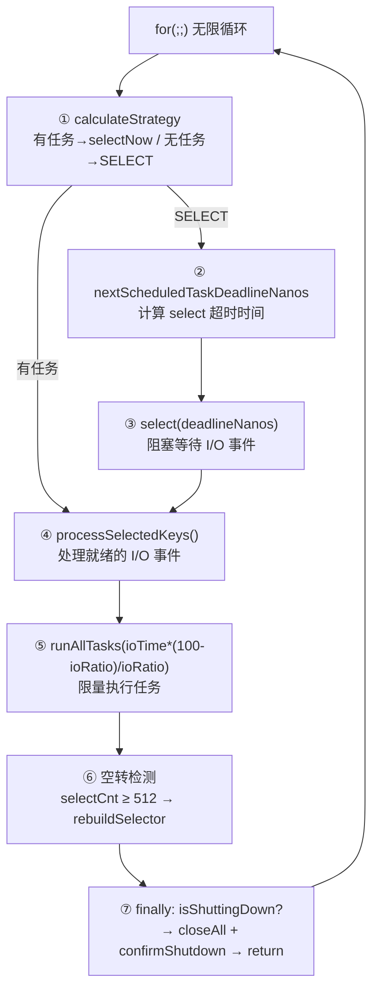
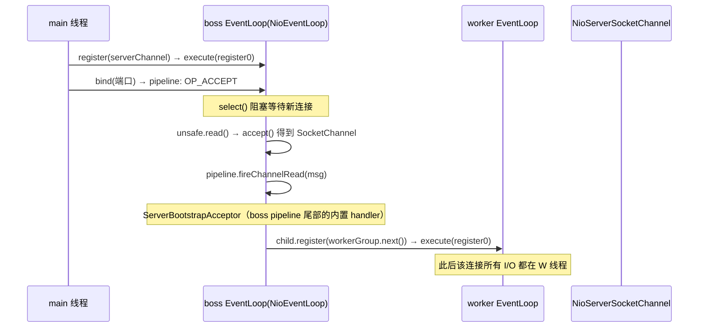

# Netty 线程模型源码深度解析

> 基于源码版本：`d:\yanyun\netty`（Netty 4.x）
> 核心模块：`transport/src/main/java/io/netty/channel/`、`common/src/main/java/io/netty/util/concurrent/`

---

## 一、总体架构：主从 Reactor + 单线程执行器

Netty 的线程模型是 **主从 Reactor 多线程模型** 的工程化实现，其类层次结构如下：

```
EventLoopGroup (接口)                          ← 线程组，本质是 EventExecutor 数组的容器
  └─ MultithreadEventLoopGroup
       └─ NioEventLoopGroup / EpollEventLoopGroup / DefaultEventLoopGroup ...
              │  内部持有 EventExecutor[] children  （默认 2×CPU 个）
              │
              └─ EventLoop (接口, 继承 EventExecutor/EventExecutorGroup)
                   └─ SingleThreadEventLoop            ← 增加 register(channel)、tailTasks
                        └─ NioEventLoop                ← 持有 Selector，真正干活
                             │
                             └─ SingleThreadEventExecutor (common 模块)
                                  │  ← 任务队列、状态机、调度队列、线程生命周期全在这里
                                  └─ 绑定 1 个 FastThreadLocalThread（永不退出的循环线程）
```

**核心设计公理：一个 `Channel` 在整个生命周期内只注册到一个 `EventLoop`，而一个 `EventLoop` 只由一个线程驱动，但它可以服务多个 `Channel`。** 这带来一个关键推论——Handler 里的回调方法**永远单线程执行**，无需任何同步。

---

## 二、启动阶段：线程从哪里来？

### 2.1 线程数量的确定

`transport/.../MultithreadEventLoopGroup.java` 静态块：

```java
DEFAULT_EVENT_LOOP_THREADS = Math.max(1, SystemPropertyUtil.getInt(
        "io.netty.eventLoopThreads", NettyRuntime.availableProcessors() * 2));
```

默认 **2 × CPU 核数**（`new NioEventLoopGroup()` 无参时）。这与内存池 arena 数量一致——每个 EventLoop 线程独占一个 arena，两套 `2×CPU` 是刻意对齐的。

### 2.2 Group 的构建：每个 child 一个 EventLoop

`common/.../MultithreadEventExecutorGroup.java` 构造器：

```java
if (executor == null) {
    executor = new ThreadPerTaskExecutor(newDefaultThreadFactory());  // ①
}
children = new EventExecutor[nThreads];
for (int i = 0; i < nThreads; i++) {
    children[i] = newChild(executor, args);   // ② 创建 NioEventLoop
    ...
}
chooser = chooserFactory.newChooser(children); // ③ 创建分配器
```

三个要点：

**① `ThreadPerTaskExecutor`（common/.../ThreadPerTaskExecutor.java）**——注意，这个 Executor 并不是"每提交一个任务开一个线程"，而是**每个 EventLoop 只 execute 一次**（那个任务就是永不返回的事件循环）：

```java
public void execute(Runnable command) {
    threadFactory.newThread(command).start();
}
```

且 `DefaultThreadFactory` 默认创建的是 **`FastThreadLocalThread`**（基于数组下标而非 ThreadLocalMap 哈希，配合内存池的 `FastThreadLocal<PoolThreadCache>` 实现 O(1) 访问）。

**② 懒启动**：`newChild` 只是创建了 `NioEventLoop` 对象（含 Selector、任务队列），**线程此时并未创建**。看 `SingleThreadEventExecutor.doStartThread()`（common/.../SingleThreadEventExecutor.java:1002）：

```java
private void doStartThread() {
    executor.execute(new Runnable() {
        @Override
        public void run() {
            thread = Thread.currentThread();      // 绑定唯一线程
            ...
            SingleThreadEventExecutor.this.run(); // ★ 进入 NioEventLoop.run() 无限循环
            ...
        }
    });
}
```

线程在**第一个任务提交时**才通过 `startThread()` 的 CAS（`ST_NOT_STARTED → ST_STARTED`）启动，之后 `run()` 方法永不返回，直到优雅关闭。

**③ Chooser：如何把 Channel 分给 EventLoop**

`common/.../DefaultEventExecutorChooserFactory.java`：

```java
if (isPowerOfTwo(executors.length)) {
    return new PowerOfTwoEventExecutorChooser(executors);  // 位运算取模
} else {
    return new GenericEventExecutorChooser(executors);     // long 计数器取模
}

// 2 的幂：idx.getAndIncrement() & (length - 1)  ← 一条 AND 指令完成轮询
// 非 2 的幂：Math.abs(idx.getAndIncrement() % length)  ← 用 long 防止溢出后分布不均
```

连接到来时 `register(channel)` → `next()` → chooser 轮询选出一个 EventLoop。**2 的幂时用位掩码替代取模**，这是无锁轮询的核心小技巧。

---

## 三、核心：`NioEventLoop.run()` 逐步拆解

`transport/.../nio/NioEventLoop.java:528`，整个 Netty 的心脏：



### 3.1 第 ① 步：策略决策——任务优先于阻塞

```java
strategy = selectStrategy.calculateStrategy(selectNowSupplier, hasTasks());
```

`DefaultSelectStrategy` 的逻辑：`hasTasks()` 为真 → 立即 `selectNow()`（非阻塞），**避免带着任务去阻塞等待**；无任务 → 返回 `SELECT` 进入阻塞。

### 3.2 第 ③ 步：带截止时间的 select 与唤醒优化

```java
long curDeadlineNanos = nextScheduledTaskDeadlineNanos(); // 最近的定时任务时间
if (curDeadlineNanos == -1L) { curDeadlineNanos = NONE; } // 无定时任务→可无限阻塞
nextWakeupNanos.set(curDeadlineNanos);                    // 发布唤醒时间点
try {
    if (!hasTasks()) {                    // 双重检查！防止 set 与 select 之间新任务入队
        strategy = select(curDeadlineNanos);
    }
} finally {
    nextWakeupNanos.lazySet(AWAKE);       // 标记已醒，lazySet 足够（单线程写）
}
```

`nextWakeupNanos`（`AWAKE=-1 / NONE=MAX_VALUE / T`）配合外部线程的 `wakeup()`：只有当外部线程 CAS 发现 `nextWakeupNanos` 不是 AWAKE 时才真正调用 `selector.wakeup()`——**省掉大量无谓的系统调用**（wakeup 是 pipe 写入，开销不小）。

### 3.3 第 ④ 步：处理就绪事件（含三个著名优化）

```java
private void processSelectedKeys() {
    if (selectedKeys != null) {
        processSelectedKeysOptimized();   // 优化路径
    } else {
        processSelectedKeysPlain(selector.selectedKeys()); // 原生路径
    }
}
```

**优化 1：`SelectedSelectionKeySet` 数组替换 HashSet。** 构造器 `openSelector()` 里通过反射 + `Unsafe` 把 JDK `SelectorImpl` 的 `selectedKeys`/`publicSelectedKeys` 字段替换成 Netty 自己的数组实现——遍历就绪 key 从 HashSet 的 O(hash) 变成纯数组顺序扫描，无 Iterator、无装箱。

**优化 2：事件处理顺序有讲究。** `processSelectedKey` 中：

```java
if ((readyOps & OP_CONNECT) != 0) {
    int ops = k.interestOps();
    ops &= ~SelectionKey.OP_CONNECT;   // 必须摘掉 OP_CONNECT，否则 select 立即返回→CPU 空转
    k.interestOps(ops);
    unsafe.finishConnect();
}
if ((readyOps & OP_WRITE) != 0) { unsafe.forceFlush(); }  // 先写：尽快释放发送队列内存
if ((readyOps & (OP_READ | OP_ACCEPT)) != 0 || readyOps == 0) { unsafe.read(); }
```

- **OP_CONNECT 是一次性事件**，处理完必须从 interestOps 清除，否则 EventLoop 会 100% CPU 空转（issue #924）；
- **先 OP_WRITE 再 OP_READ**：优先 flush 积压数据释放内存；
- `readyOps == 0` 也调 `read()`：兜底某些 JDK 收到 RST 时的空转 bug。

**优化 3：`needsToSelectAgain`。** `cancel(key)` 中每取消 256 个 key 置位该标志，处理循环中检测到就 `selectAgain()` 重建继续处理，避免大量失效 key 拖慢遍历。

### 3.4 第 ⑤ 步：`ioRatio` 控制 I/O 与任务的时间配比

```java
if (ioRatio == 100) {
    processSelectedKeys();
    ranTasks = runAllTasks();                      // 不限时，全部跑完
} else if (strategy > 0) {
    long ioStartTime = System.nanoTime();
    processSelectedKeys();
    long ioTime = System.nanoTime() - ioStartTime;
    // ioRatio=50: 任务时间=ioTime；ioRatio=75: 任务时间=ioTime/3
    ranTasks = runAllTasks(ioTime * (100 - ioRatio) / ioRatio);
} else {
    ranTasks = runAllTasks(0);                     // 只跑最小批次
}
```

默认 `ioRatio=50`（I/O 与任务 1:1）。**这就是防止"业务任务饿死 I/O"的核心机制**：任务执行带 deadline，`runAllTasks(timeoutNanos)` 里每执行 64 个任务检查一次超时（`if ((runTasks & 0x3F) == 0)`，因为 `nanoTime()` 本身有成本）。

### 3.5 第 ⑥ 步：epoll 空转 bug 防御

```java
if (SELECTOR_AUTO_REBUILD_THRESHOLD > 0 && selectCnt >= SELECTOR_AUTO_REBUILD_THRESHOLD) { // 默认512
    rebuildSelector();   // 新建 Selector，把所有 Channel 迁移过去
}
```

老 JDK 的 epoll bug 会让 `select()` 在无事件时也立即返回导致 CPU 100%。Netty 的对策：统计 `selectCnt`（空转次数），连续过早返回 ≥512 次就**重建 Selector** 并迁移所有注册的 Channel。

---

## 四、任务提交路径：外部线程如何与 EventLoop 交互

`common/.../SingleThreadEventExecutor.java:851`：

```java
private void execute(Runnable task, boolean immediate) {
    boolean inEventLoop = inEventLoop();   // 判断当前线程是否就是 EventLoop 线程
    addTask(task);                          // 无条件入队（MPSC 队列）
    if (!inEventLoop) {
        startThread();                      // 线程未启动则启动
        if (isShutdown()) { ... removeTask + reject ... }
    }
    if (!addTaskWakesUp && immediate) {
        wakeup(inEventLoop);                // 唤醒可能阻塞在 select 的线程
    }
}
```

两个队列体系（`NioEventLoop` 构造时创建）：

| 队列 | 用途 | 特点 |
|---|---|---|
| `taskQueue` | 普通 + 定时任务统一执行队列 | 默认 MPSC（多生产者单消费者），外部线程 offer、EventLoop 线程 poll，**无锁** |
| `scheduledTaskQueue`（优先队列） | 定时任务 | 到期后被 `fetchFromScheduledTaskQueue()` 搬运进 taskQueue 执行 |
| `tailTasks`（`SingleThreadEventLoop`） | 每轮循环末尾执行 | `executeAfterEventLoopIteration()`，用于 flush 指标采集等收尾 |

**这套机制是 Netty 一切"线程安全"的基石**：任何线程想操作 Channel，最终都会被转成任务扔进该 Channel 所属 EventLoop 的队列里串行执行。

---

## 五、Channel 注册流程：boss 与 worker 的接力

以服务端为例，`AbstractChannel.register()`（transport/.../AbstractChannel.java:464）：

```java
public final void register(EventLoop eventLoop, final ChannelPromise promise) {
    ...
    AbstractChannel.this.eventLoop = eventLoop;      // ★ 终身绑定，不再更换
    if (eventLoop.inEventLoop()) {
        register0(promise);                          // 已在 EventLoop 线程→直接执行
    } else {
        eventLoop.execute(new Runnable() {           // 主线程（main）→ 提交任务
            public void run() { register0(promise); }
        });
    }
}
```

`register0`（在 EventLoop 线程内）依次完成：

```java
doRegister();                              // selectionKey = javaChannel().register(selector, 0, this)
pipeline.invokeHandlerAddedIfNeeded();     // 回调 handlerAdded
safeSetSuccess(promise);
pipeline.fireChannelRegistered();          // 传播 channelRegistered
if (isActive()) {
    if (firstRegistration) { pipeline.fireChannelActive(); }  // → head.read() → 注册 OP_ACCEPT
}
```

**主从接力的完整链路**：



`ServerBootstrapAcceptor` 是 `ServerBootstrap` 在 `init(channel)` 时偷偷加到 boss pipeline 末尾的 handler，它的 `channelRead` 把客户端 Channel 拿到 `childGroup`（worker 组）注册——**boss 只管 accept，worker 管连接的所有后续 I/O**。

---

## 六、Pipeline 事件传播的线程规则

`AbstractChannelHandlerContext.invokeChannelRead()`（transport/.../AbstractChannelHandlerContext.java:416）：

```java
static void invokeChannelRead(final AbstractChannelHandlerContext next, Object msg) {
    final Object m = next.pipeline.touch(msg, next);
    EventExecutor executor = next.executor();       // ① 该 handler 的执行器
    if (executor.inEventLoop()) {
        next.invokeChannelRead(m);                  // ②a 同线程：直接调用（零开销）
    } else {
        executor.execute(new Runnable() {           // ②b 跨线程：打包成任务入队
            public void run() { next.invokeChannelRead(m); }
        });
    }
}
```

`executor()` 的解析（:130）：

```java
public EventExecutor executor() {
    if (executor == null) {
        return channel().eventLoop();   // 默认：handler 没指定 executor → 用 channel 的 EventLoop
    }
    return executor;                    // addLast(group, handler) 时可为单个 handler 指定独立线程池
}
```

这意味着两种模式：

1. **默认**：整条 pipeline 与 I/O 同线程，事件传播就是普通方法调用（`fireChannelRead` 即 `invokeChannelRead(findContextInbound(...))`，一个链式递归），**无队列、无锁、无上下文切换**；
2. **指定 executor**：`pipeline.addLast(businessGroup, handler)` 可让耗时业务 handler 跑在独立线程池，I/O 线程不被阻塞——Netty 用同一个 `inEventLoop ? 直接调 : 入队` 模式优雅支持。

---

## 七、优雅关闭：状态机 + 静默期

`SingleThreadEventExecutor` 的状态机：

```
ST_NOT_STARTED → ST_STARTED → ST_SHUTTING_DOWN → ST_SHUTDOWN → ST_TERMINATED
```

`run()` 的 finally 中每轮检查：

```java
if (isShuttingDown()) {
    closeAll();                 // 关闭所有 Channel（cancel 所有 key）
    if (confirmShutdown()) return;   // 确认后退出 run() → 线程结束
}
```

`confirmShutdown()` 的"静默期"逻辑：

- 持续跑完队列中剩余任务（`runAllTasks()` + shutdown hooks）；
- 若静默期（默认 2s）内没有新任务提交（`nanoTime - lastExecutionTime <= quietPeriod` 则 `sleep(100)` 再查），且超时上限（默认 15s）未到 → 允许退出；
- `Group.shutdownGracefully()` 会逐个调用所有 child 的 shutdownGracefully，全部 TERMINATED 后 `terminationFuture` 完成。

---

## 八、全文总结：一张表看懂

| 组件 | 源码位置 | 线程模型职责 |
|---|---|---|
| `MultithreadEventLoopGroup` | transport | 2×CPU 个 child，`register` 时用 chooser 分配 |
| `DefaultEventExecutorChooserFactory` | common | 2 的幂用位掩码轮询，否则 long 取模 |
| `ThreadPerTaskExecutor` + `DefaultThreadFactory` | common | 为每个 EventLoop 创建唯一的 `FastThreadLocalThread`（懒启动） |
| `SingleThreadEventExecutor` | common | MPSC taskQueue、调度队列、状态机、`execute`/`runAllTasks`/关闭流程 |
| `SingleThreadEventLoop` | transport | `register(channel)`、tailTasks |
| `NioEventLoop.run()` | transport | select→processSelectedKeys→runAllTasks 主循环，ioRatio 配时，空转重建 Selector |
| `AbstractChannel.register` | transport | Channel 与 EventLoop 终身绑定 |
| `AbstractChannelHandlerContext` | transport | `inEventLoop ? 直接调用 : execute 入队`，支持 handler 级独立线程池 |

**三条设计主线贯穿始终**：

1. **串行化消除锁**：Channel↔EventLoop↔Thread 一一绑定，所有操作收敛到单线程队列（这与内存池的 `PoolThreadCache` 无锁化是同一哲学）；
2. **跨线程统一范式**：无论是 `execute`、`register`、pipeline 事件传播还是 `channel.write()`，全部遵循 `inEventLoop() ? 直接执行 : 提交任务` 这一个模式；
3. **微优化到指令级**：位掩码轮询、数组化 selectedKeys、`lazySet`、64 次任务查一次超时、避免无效 `selector.wakeup()`。
