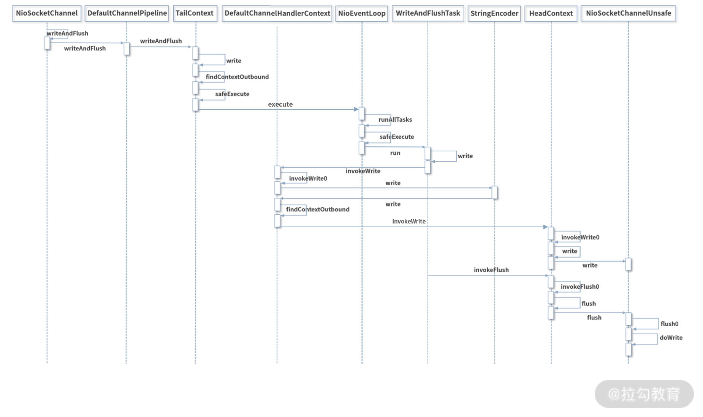

##  ChannelFuture cf = bootstrap.bind(6668).sync()  调用栈

```text
ServerBootstarp中的bind方法
  -- AbstractBootstrap 抽象类中的bind方法
     --- io.netty.bootstrap.AbstractBootstrap#bind()
       --- io.netty.bootstrap.AbstractBootstrap#doBind()
          以下分两步：
             --- 先执行 io.netty.bootstrap.AbstractBootstrap#initAndRegister()
                 以下也分两步：
                  --- io.netty.bootstrap.ChannelFactory#newChannel()  初始化个Channle出来，NioServerSocketChannel,OioServerSocketChannel等... 
                     --- io.netty.channel.ReflectiveChannelFactory 底层通过反射，其实就是把配置中的写的NioServerSocketChannel.class进行实例化
                  --- io.netty.channel.EventLoopGroup#register(io.netty.channel.Channel); 将Channel和EventLoop线程绑定起来
                     --- io.netty.channel.SingleThreadEventLoop#register(io.netty.channel.ChannelPromise) 调用EventLoop的register
                       --- io.netty.channel.Channel.Unsafe#register 表面上看是EventLoop在注册，其底层其实是调用绑定的Channel中的register
                         ---io.netty.channel.AbstractChannel.AbstractUnsafe#register 然后Channel又调用AbstractUnsafe内部抽象类的register
                                   ps:
                                   该方法做了一系类的检查操作，包括设计Promise，而且这一步有个关键的点：
                                             AbstractChannel.this.eventLoop = eventLoop;
                                   真正eventloop赋值给AbstractChannel的成员变量中，真正把eventloop和channel绑定起来
                                   而且
                                             eventLoop.execute(()-> {register0(promise); });
                                   这个启动EventLoop线程！！！就是再这一步执行的
                              --- io.netty.channel.AbstractChannel.AbstractUnsafe#register0 然后又调用的register0这个方法
                                   ps:
                                    该方法做一些回调通知操作：
                                    
                                       pipeline.invokeHandlerAddedIfNeeded();  通知调用方进行HandlerAdd回调
                                       pipeline.fireChannelRegistered();   回调Channel注册回调
                                       
                                 --- io.netty.channel.AbstractChannel.AbstractUnsafe.beginRead 接着就开始执行数据读取
                                   --- io.netty.channel.AbstractChannel.doBeginRead 还是由AbstractChanel中的Unsafe子类去执行  
                                     --- io.netty.channel.nio.AbstractNioChannel.doBeginRead 这个时候就来到了子类AbstractNioChannel中
                                         ps:
                                          该方法将读事件注册到Selector上：
                                          
                                             final int interestOps = selectionKey.interestOps();
                                               if ((interestOps & readInterestOp) == 0) {
                                                    selectionKey.interestOps(interestOps | readInterestOp);
                                               }
                                               
                                            然后当读事件响应的时候，又哪一个方法进行执行处理的呢，答案是：EventLoop中的run方法，会不断进入死循环判断事件的响应类型
                                          --- io.netty.channel.nio.NioEventLoop.processSelectedKeysOptimized();  EventLoop中run方法执行的 
                                              （该方法netty做了性能优化，其底层就是把原来的set换成数组，减少哈希计算和冲突）   
                                            --- io.netty.channel.nio.NioEventLoop.processSelectedKey(java.nio.channels.SelectionKey, io.netty.channel.nio.AbstractNioChannel)
                                                ps；该方法中当读事件响应时候，就会调用unsafe.read()，又重新回到AbstracUnsafe中，然后由子类进行事件的处理
                                                
                                                if ((readyOps & (SelectionKey.OP_READ | SelectionKey.OP_ACCEPT)) != 0 || readyOps == 0) {
                                                      unsafe.read();
                                                 }
                                                 
                                              <<<< 处理读事件 >>>>  
                                              --- io.netty.channel.nio.AbstractNioByteChannel.NioByteUnsafe#read  这个方法中，就是调用了AbstractNioByteChannel的doReadBytes方法
                                                  ps:
                                                  该方法中，会先调用AbstractNioByteChannel的allocate方法，通过ByteBufAllocator分配具体的ByteBuf，具体的实例对象为PooledByteBufAllocator，
                                                  底层用 jemalloc 风格的 chunk/page/subpage 三级结构 管理堆外内存,可通过 -Dio.netty.allocator.type=unpooled 
                                                  或 channel.config().setAllocator(...) 切换.Handle 是“一次读循环”的上下文，保存了本次应该分配多大的 buffer、上轮读了多少字节、是否继续读等状态。
                                                  4.2 以后默认实现是 AdaptiveRecvByteBufAllocator.HandleImpl；
                                                  它内部维护 指数回退表：64 → 128 → 256 … → 65536（可配置上限），根据 实际读到的字节数 动态调整下一次大小，避免 “大马拉小车” 或 “小马拉大车”。

                                                   
                                                      final ByteBufAllocator allocator = config.getAllocator();
                                                      final RecvByteBufAllocator.Handle allocHandle = recvBufAllocHandle();
                                                      byteBuf = allocHandle.allocate(allocator);
                                                 
                                                 --- io.netty.channel.nio.AbstractNioByteChannel.doReadBytes 接着调用doReadBytes方法, 把内核数据搬进 ByteBuf 
                                                    ps:
                                                      NIO实现:
                                                        - 抽象层：SocketChannel.read(byteBuf.internalNioBuffer(...))
                                                        - 底层：read(2)  →  Linux sys_read(fd, user_buf, len)
                                                      Epoll/IO_URING 实现:
                                                        - epoll_wait 返回后 → recvmsg(iovec) 直接写进 pooled memory（中间省掉一次  ByteBuffer  中间拷贝）
                                                      之后调用：
                                                        allocHandle.lastBytesRead(localReadAmount);
                                                        allocHandle.readComplete();   // 更新指数表，如果本次读满，下次  guess  会翻倍；没读满就回退到更小档。
                                                      
                                                      
                                                    
                                                  --- io.netty.channel.ChannelPipeline.fireChannelRead() 之后调用fireChannelRead方法，由channelPiple管道进行数据传播，
                                                        从 HeadContext 开始，依次调用每个  ChannelInboundHandler.channelRead()     
                                                   --- io.netty.channel.ChannelPipeline.fireChannelReadComplete() 接着调用fireChannelReadComplete方法，由channelPiple管道进行数据传播
                                              
                                              <<< 处理写事件 >>>
                                              --- io.netty.channel.nio.AbstractNioChannel.NioUnsafe.forceFlush() 
                                               --- io.netty.channel.AbstractChannel.AbstractUnsafe.flush0 最终会调用flush0这个方法，处于AbstractChannel中
                                               
                                                 ps：执行流程如下
                                                   用户线程
                                                      └── ctx.writeAndFlush(msg)  → 进入 pipeline
                                                      └── HeadContext.write → 把 msg 放进 ChannelOutboundBuffer
                                                      └── HeadContext.flush → unsafe.flush()
                                                      └── EventLoop OP_WRITE 就绪 → unsafe.forceFlush()
                                                           ├── 1. flush0() 将 outboundBuffer 里的 ByteBuf 全部写进 JDK SocketChannel
                                                           ├── 2. 如果还有剩余，继续监听 OP_WRITE
                                                           └── 3. 如果写完，清除 OP_WRITE，防止 CPU 空转

                                                    --- io.netty.channel.AbstractChannel.doWrite 接着执行doWrite方法，该方法处于AbstractChannel中，由子类进行重写   
                                                        --- io.netty.channel.nio.AbstractNioByteChannel.doWrite  取出对头消息，连续写 16 次还没写完 → 说明内核缓冲区满了，先让出 CPU，等下一次 OP_WRITE 事件再继续。
                                                          --- io.netty.channel.nio.AbstractNioByteChannel.doWriteInternal 执行doWriteInternal, 主要把object对象转为ByteBuf对象
                                                            ps: 
                                                               doWriteInternal  内部：
                                                                  - 如果obj的类型为 ByteBuf  →  doWriteBytes(buf)  →  SocketChannel.write(ByteBuffer) 
                                                                  - 如果obj的类型为 FileRegion  →  doWriteFileRegion(region)  →  transferTo  零拷贝
                                                                  - 如果obj的类型不为上述两种类型 → 抛出异常 
                                                                  以下以ByteBuf类型为例继续执行调用栈
                                                               --- io.netty.channel.nio.AbstractNioByteChannel.doWriteBytes 来到doWriteBytes，由具体子类NioSocketChannel负责执行
                                                                --- io.netty.channel.socket.nio.NioSocketChannel.doWriteBytes   
                                                                  ps:
                                                                    buf.readBytes(javaChannel(),buf.readableBytes())
                                                                  --- 
                                                                 
```


## Netty的线程模型


## NioEventLoop 线程的启动原理

```java
  
  
    public static void main(String[] args) throws Exception {
        
        //创建BossGroup 和 WorkerGroup
        //说明
        //1. 创建两个线程组 bossGroup 和 workerGroup
        //2. bossGroup 只是处理连接请求 , 真正的和客户端业务处理，会交给 workerGroup完成
        //3. 两个都是无限循环
        //4. bossGroup 和 workerGroup 含有的子线程(NioEventLoop)的个数
        //   默认实际 cpu核数 * 2
        EventLoopGroup bossGroup = new NioEventLoopGroup(1);
        EventLoopGroup workerGroup = new NioEventLoopGroup(); //8
        
        try {
            //创建服务器端的启动对象，配置参数
            ServerBootstrap bootstrap = new ServerBootstrap();
            //使用链式编程来进行设置
            bootstrap.group(bossGroup, workerGroup) //设置两个线程组
                    .channel(NioServerSocketChannel.class) //使用NioSocketChannel 作为服务器的通道实现
                    .option(ChannelOption.SO_BACKLOG, 128) // 设置线程队列得到连接个数
                    .childOption(ChannelOption.SO_KEEPALIVE, true) //设置保持活动连接状态
            //          .handler(null) // 该 handler对应 bossGroup , childHandler 对应 workerGroup
                    .childHandler(new ChannelInitializer<SocketChannel>() {//创建一个通道初始化对象(匿名对象)
                        //给pipeline 设置处理器
                        @Override
                        protected void initChannel(SocketChannel ch) throws Exception {
                            System.out.println("客户socketchannel hashcode=" + ch.hashCode()); //可以使用一个集合管理 SocketChannel， 再推送消息时，可以将业务加入到各个channel 对应的 NIOEventLoop 的 taskQueue 或者 scheduleTaskQueue
                            ch.pipeline().addLast(new NettyServerHandler());
                        }
                    }); // 给我们的workerGroup 的 EventLoop 对应的管道设置处理器

            System.out.println(".....服务器 is ready...");

            //绑定一个端口并且同步, 生成了一个 ChannelFuture 对象
            //启动服务器(并绑定端口)
            ChannelFuture cf = bootstrap.bind(6668).sync();

            //给cf 注册监听器，监控我们关心的事件

            cf.addListener(new ChannelFutureListener() {
                @Override
                public void operationComplete(ChannelFuture future) throws Exception {
                    if (cf.isSuccess()) {
                        System.out.println("监听端口 6668 成功");
                    } else {
                        System.out.println("监听端口 6668 失败");
                    }
                }
            });

            //对关闭通道进行监听
            cf.channel().closeFuture().sync();
        }finally {
            bossGroup.shutdownGracefully();
            workerGroup.shutdownGracefully();
        }
    }
      

```
## 底层执行流程图


## NioEventLoop中的核心执行逻辑

`NioEventLoop` 类中的 `run()` 方法是事件循环的核心，它负责不断地监听 I/O 事件并处理任务。

**核心逻辑概述：**

1.  **无限循环 (`for (;;)`):** 事件循环的主体，会一直运行直到 `EventLoop` 被关闭。
2.  **选择策略 (`selectStrategy`):**
    *   在每次循环开始时，通过 `selectStrategy.calculateStrategy(selectNowSupplier, hasTasks())` 来决定下一步的操作。
    *   `SelectStrategy.CONTINUE`: 跳过本次 select，直接进入下一次循环（通常是有任务需要立即处理）。
    *   `SelectStrategy.BUSY_WAIT`: (NIO 不支持) 会退化到 `SELECT`。
    *   `SelectStrategy.SELECT`: 执行 `select()` 操作，等待 I/O 事件或任务。
3.  **I/O 事件处理 (`select()`):**
    *   计算下一次计划任务的截止时间 `curDeadlineNanos`。
    *   如果当前没有任务，则调用 `select(curDeadlineNanos)` 方法阻塞等待 I/O 事件，或者直到下一个计划任务的时间到达，或者被 `wakeup()` 唤醒。
    *   如果 `select()` 过程中发生 `IOException`，通常意味着 `Selector` 出现问题，会尝试重建 `Selector` (`rebuildSelector0()`)。
4.  **处理 I/O 事件和任务的平衡 (`ioRatio`):**
    *   `ioRatio` 控制了 I/O 操作和非 I/O 任务（用户提交的任务）之间的时间分配比例。
    *   如果 `ioRatio == 100`：优先处理所有已就绪的 I/O 事件 (`processSelectedKeys()`)，然后执行所有待处理的任务 (`runAllTasks()`)。
    *   如果 `ioRatio < 100`：
        *   记录处理 I/O 事件的开始时间 `ioStartTime`。
        *   处理已就绪的 I/O 事件 (`processSelectedKeys()`)。
        *   计算 I/O 操作花费的时间 `ioTime`。
        *   根据 `ioRatio` 分配给非 I/O 任务的时间，然后执行这些任务 (`runAllTasks(ioTime * (100 - ioRatio) / ioRatio)`)。
5.  **处理 `Selector` 空轮询问题:**
    *   `selectCnt` 记录 `select()` 操作连续非阻塞返回的次数。
    *   `selectReturnPrematurely()`: 如果 `select()` 返回且有任务执行或有 I/O 事件处理，则认为不是空轮询，重置 `selectCnt`。
    *   `unexpectedSelectorWakeup()`:
        *   如果线程被中断，则认为是意外唤醒，重置 `selectCnt`。
        *   如果 `selectCnt` 超过 `SELECTOR_AUTO_REBUILD_THRESHOLD`（一个阈值，默认为 512），则认为发生了 JDK 的 epoll空轮询 bug，会触发 `rebuildSelector()` 来重建 `Selector`。
6.  **异常处理:**
    *   捕获 `CancelledKeyException`，这通常是无害的，记录日志。
    *   捕获其他 `Throwable`，调用 `handleLoopException()` 记录警告日志并休眠1秒，防止因连续快速失败导致 CPU 占用过高。
7.  **关闭处理:**
    *   在 `finally` 块中，检查 `isShuttingDown()` 状态。
    *   如果正在关闭，则调用 `closeAll()` 关闭所有注册的 `Channel`，并调用 `confirmShutdown()` 确认关闭完成，然后退出循环。

```java
    @Override
    protected void run() {
        int selectCnt = 0; // 用于检测Selector空轮询的计数器
        for (;;) { // 事件循环的无限循环
            try {
                int strategy;
                try {
                    // 根据当前是否有任务，决定select策略
                    // selectNowSupplier 是一个 IntSupplier，其 get() 方法会调用 selectNow()
                    strategy = selectStrategy.calculateStrategy(selectNowSupplier, hasTasks());
                    switch (strategy) {
                    case SelectStrategy.CONTINUE: // 如果策略是CONTINUE，则跳过本次select，直接进入下一次循环
                        continue;

                    case SelectStrategy.BUSY_WAIT:
                        // NIO不支持真正的BUSY_WAIT，会退化到SELECT
                        // fall-through to SELECT since the busy-wait is not supported with NIO

                    case SelectStrategy.SELECT: // 如果策略是SELECT，则执行select操作
                        // 获取下一个计划任务的截止时间（纳秒）
                        long curDeadlineNanos = nextScheduledTaskDeadlineNanos();
                        if (curDeadlineNanos == -1L) { // 如果没有计划任务
                            curDeadlineNanos = NONE; // 设置为NONE，表示select可以一直阻塞
                        }
                        nextWakeupNanos.set(curDeadlineNanos); // 设置下一次唤醒时间，用于优化wakeup调用
                        try {
                            if (!hasTasks()) { // 如果当前没有立即执行的任务
                                // 执行select操作，阻塞直到有IO事件、超时或被唤醒
                                // deadlineNanos 是根据 curDeadlineNanos 计算出的超时时间
                                strategy = select(curDeadlineNanos);
                            }
                        } finally {
                            // 只是为了帮助阻止不必要的selector唤醒，所以使用lazySet是可以的（没有竞争条件）
                            nextWakeupNanos.lazySet(AWAKE); // 重置唤醒状态为AWAKE
                        }
                        // fall through
                    default:
                        // 默认情况或从SELECT分支下来
                    }
                } catch (IOException e) {
                    // 如果在这里收到IOException，说明Selector出错了。重建selector并重试。
                    // 参考: https://github.com/netty/netty/issues/8566
                    rebuildSelector0(); // 重建Selector
                    selectCnt = 0;      // 重置空轮询计数器
                    handleLoopException(e); // 处理循环中的异常
                    continue; // 继续下一次循环
                }

                selectCnt++; // select操作计数增加
                cancelledKeys = 0; // 重置已取消的key的数量
                needsToSelectAgain = false; // 重置是否需要再次select的标志
                final int ioRatio = this.ioRatio; // 获取当前的IO比例设置
                boolean ranTasks; // 标记是否执行了任务
                if (ioRatio == 100) { // 如果IO比例为100%，则优先处理IO，然后处理所有任务
                    try {
                        if (strategy > 0) { // strategy > 0 表示select操作返回了至少一个就绪的channel
                            processSelectedKeys(); // 处理已选择的键（即IO事件）
                        }
                    } finally {
                        // 确保总是运行任务
                        ranTasks = runAllTasks(); // 运行所有待处理的任务
                    }
                } else if (strategy > 0) { // 如果IO比例小于100%，并且有IO事件
                    final long ioStartTime = System.nanoTime(); // 记录IO处理开始时间
                    try {
                        processSelectedKeys(); // 处理已选择的键（即IO事件）
                    } finally {
                        // 确保总是运行任务
                        final long ioTime = System.nanoTime() - ioStartTime; // 计算IO处理耗时
                        // 根据IO比例和IO耗时，计算分配给任务队列的运行时间，并运行任务
                        ranTasks = runAllTasks(ioTime * (100 - ioRatio) / ioRatio);
                    }
                } else { // 如果没有IO事件 (strategy <= 0)
                    ranTasks = runAllTasks(0); // 运行最少数量的任务（通常是队列中的所有任务，或者直到没有任务）
                }

                if (selectReturnPrematurely(selectCnt, ranTasks, strategy)) {
                    // 如果select过早返回（但处理了IO或任务），重置selectCnt
                    selectCnt = 0;
                } else if (unexpectedSelectorWakeup(selectCnt)) { // 意外的selector唤醒 (不寻常的情况)
                    // 如果是意外唤醒（例如线程中断或空轮询次数过多），重置selectCnt
                    // 如果空轮询次数过多，会触发rebuildSelector()
                    selectCnt = 0;
                }
            } catch (CancelledKeyException e) {
                // 无害的异常 - 仍然记录日志
                if (logger.isDebugEnabled()) {
                    logger.debug(CancelledKeyException.class.getSimpleName() + " raised by a Selector {} - JDK bug?",
                            selector, e);
                }
            } catch (Error e) { // 捕获Error，直接抛出
                throw e;
            } catch (Throwable t) { // 捕获其他所有异常
                handleLoopException(t); // 处理循环中的异常
            } finally {
                // 即使循环处理抛出异常，也总是处理关闭操作
                try {
                    if (isShuttingDown()) { // 检查是否正在关闭
                        closeAll(); // 关闭所有注册的channel和资源
                        if (confirmShutdown()) { // 确认关闭完成
                            return; // 退出run方法，结束事件循环
                        }
                    }
                } catch (Error e) { // 捕获Error，直接抛出
                    throw e;
                } catch (Throwable t) { // 捕获其他所有异常
                    handleLoopException(t); // 处理循环中的异常
                }
            }
        }
    }
```


